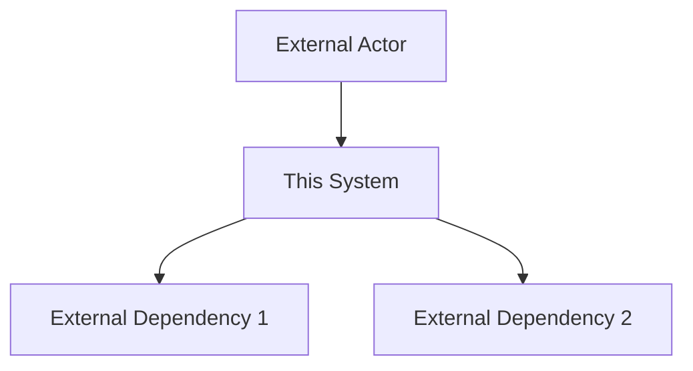

# Phase 2 — Design
Perform Phase 2 contextual engineering. Goal — make architectural decisions based on facts from Phase 1.
---
## Step 1. Read all documents from docs/Research/
Every architectural decision must reference a specific fact from Research. Decisions without support from facts are assumptions, not design.
---
## Step 2. Create Design documents in docs/Design/
### 2.1 Interface Specification (interface-spec.md)
Define the public interface of the component — what it provides to consumers:
- List of methods / endpoints / tools with one-line description
- JSON Schema for each input and output (real valid JSON Schema, not pseudocode)
- Constraints: allowed values, maximum sizes, formats
- Error codes and messages (without revealing internal details)
Principles:
- One method — one responsibility
- Input parameters — typed, not raw parameters of the external system
- External system errors are mapped to typed errors of the interface
### 2.2 Data Schema and Normalization (data-schemas.md)
For each external data structure define:
- Field mapping: external_field → internal_field with transformation rule
- Transformation rules: type coercion (e.g. numeric IDs → strings), date formats (→ ISO 8601), truncation of long strings with [truncated] marker
- Fields that are dropped — with justification for each (UI-only, duplicative, sensitive)
- Null values: strategy (omit keys or return null)
- Maximum payload size — explicitly, in bytes or KB
### 2.3 Architecture (architecture.md)
Three mandatory diagrams in Mermaid:
**C4 Context** — external view of the system:

**C4 Container** — internal components:
- Input layer (validation, protocol)
- Business logic layer
- Data normalization layer
- Data access layer (HTTP client, DB, etc.)
- Cache (if present)
**Sequence Diagram** — main scenario from request to response:
```mermaid
sequenceDiagram
    Actor->>Component: request
    Component->>External: call
    External-->>Component: response
    Component-->>Actor: normalized result
```
### 2.4 Caching Strategy (caching-strategy.md) — if applicable
- What to cache: each data type with justification (changes often/rarely)
- TTL per data type with justification (tied to TTL from auth-flow.md, change frequency)
- Cache key: format and components
- Invalidation strategy: by TTL, by event (401, update), explicit deletion
- Constraints: maximum size, backend (in-process / Redis / other)
- Sweep: how expired records are removed
### 2.5 Access Control (access-control.md) — mandatory
Evaluate at least two options. For each:
#### Option A: [name]
**Authentication flow:** step 1 → step 2 → step 3
**Pros:**
**Cons:**
**Audit trail:** [yes/no, what is logged]
**Compromise risk:** [what happens if this component is compromised]
**Implementation complexity:** [low/medium/high]
**Recommendation:** Option X, because [2–5 sentences tied to facts from Research].
---
## Rules for Design Documents
- Every decision references a source in docs/Research/ (file, section)
- Alternatives are shown explicitly — the choice does not look like the only option
- JSON Schema — valid syntax, not pseudocode
- Mermaid diagrams — working syntax (check brackets and quotes)
- Rationale of decisions — in the document, not in your head
---
## Step 3. Stop Questions
After creating the documents answer:
1. Has the access control decision been made? Does it require external approval (team, security)?
2. Is the technology stack fixed? Are there external dependencies that need verification?
3. Has the main architectural risk been identified and documented?
4. Are there any unresolved forks that will block task decomposition?
---
Completion: **"Phase 2 (Design) completed. Run /plan for task decomposition."**