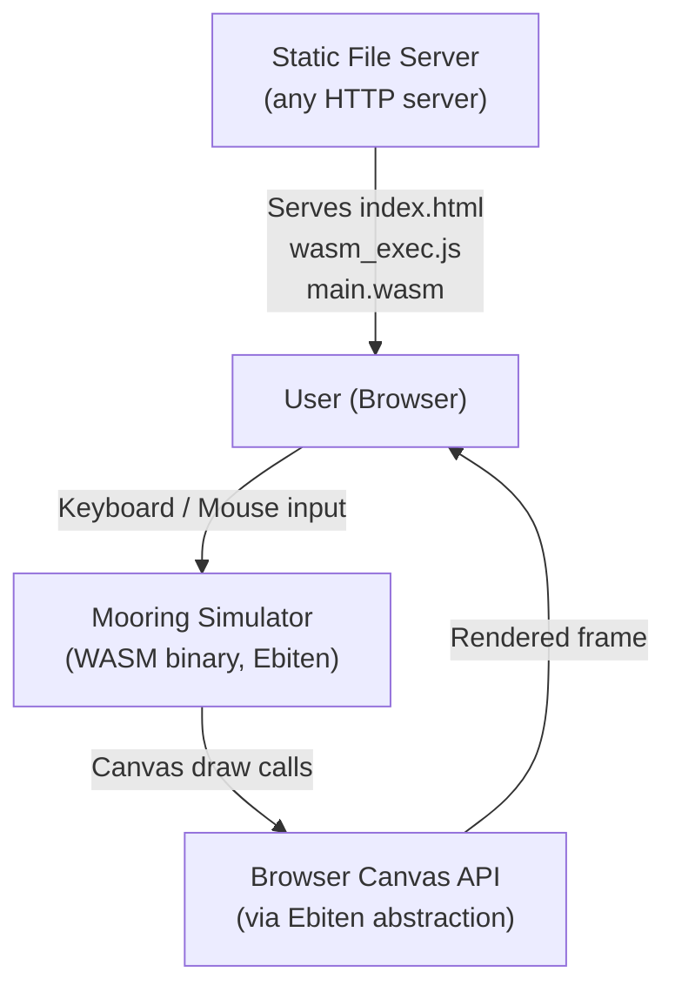
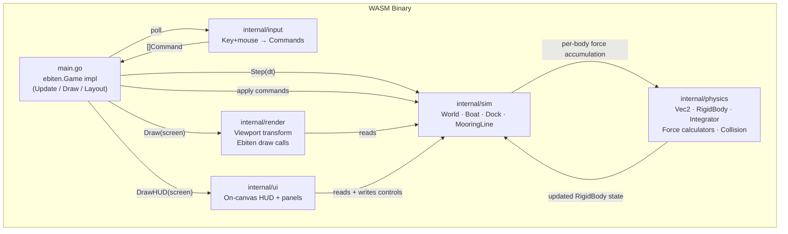
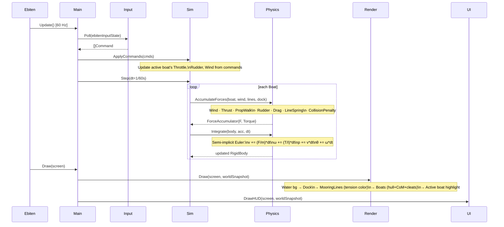

# Architecture — Mooring Simulator

*Every decision references a fact from docs/Research/.*

---

## Decisions Made Here

| # | Decision | Rationale | Source |
|---|----------|-----------|--------|
| D1 | Physics world uses SI units (meters, kg, N, s) | Keeps force constants intuitive; scale to pixels via viewport transform | constraints.md U7 |
| D2 | Coordinate system: Y-up in physics, Y-down in screen-space; transform at render boundary | Standard game pattern; physics formulas stay sign-consistent | domain-model.md "Coordinate System" |
| D3 | Collision response: **penalty spring** | Boats move at <5 m/s — no tunneling risk; plugs directly into force accumulator pattern already defined; impulse-based adds constraint-solver complexity without benefit at this speed | domain-model.md "Contact/Collision Forces", constraints.md U6 |
| D4 | Physics integrator: **semi-implicit Euler** | Stable for spring systems (mooring lines); simpler than RK4; standard for real-time games | constraints.md "What Can Be Decided Without Clarification" |
| D5 | Simulation: **real-time continuous** | Ebiten's fixed-timestep `Update()` is the natural loop; no pause required by spec | tech-options.md "Option A — Ebiten" |
| D6 | Mooring lines: **elastic spring only** for MVP | Hookean spring + damper already modeled; inextensible requires constraint solver — defer | domain-model.md "MooringLine", constraints.md U9 |
| D7 | Boat parameters: **fixed defaults per type** for MVP | Reduces UI scope; tunable constants for feel, not naval accuracy | constraints.md U10, U3 |
| D8 | All packages **pure Go, no CGO** | CGO incompatible with GOOS=js GOARCH=wasm | constraints.md T1 |
| D9 | **No Ebiten dependency in physics or sim packages** | Keeps simulation logic testable outside browser; only render+ui+main depend on Ebiten | tech-options.md "Recommendation" |

---

## C4 Context Diagram



No external APIs, no network calls after initial load. The WASM binary is fully self-contained.

---

## C4 Container Diagram



**Dependency rule:** `physics` ← `sim` ← `main` → `render`, `input`, `ui`.  
`physics` and `sim` must not import Ebiten.

---

## Per-Tick Sequence Diagram



---

## Package Structure

```
mooring-simulator/
├── main.go                  # ebiten.Game: Update/Draw/Layout, wires all packages
├── go.mod                   # module: github.com/.../mooring-simulator
├── go.sum
├── index.html               # WASM loader (loads wasm_exec.js + main.wasm)
├── wasm_exec.js             # Go WASM runtime shim (copy from GOROOT/misc/wasm)
└── internal/
    ├── physics/
    │   ├── vec2.go          # Vec2 type + math helpers (rotate, dot, cross, normalize)
    │   ├── body.go          # RigidBody struct + semi-implicit Euler Integrate()
    │   ├── forces.go        # Stateless force funcs: Wind, Thrust, PropWalk, Rudder, Drag
    │   ├── mooring.go       # SpringForce(line, cleatWorldPos, vel) → Vec2
    │   └── collision.go     # SAT convex-polygon overlap + penalty spring response
    ├── sim/
    │   ├── types.go         # ThrottleState, CleatID, BoatType enums + constants
    │   ├── boat.go          # Boat struct, cleat world-position helper, defaults
    │   ├── dock.go          # Dock struct, straight-pier constructor, polygon accessor
    │   ├── world.go         # World struct, Step(dt), ApplyCommand()
    │   └── constants.go     # Tunable physics constants (thrustTable, dragCoeffs, etc.)
    ├── render/
    │   ├── viewport.go      # Viewport: world→screen transform, zoom, pan
    │   ├── renderer.go      # Renderer.Draw(): orchestrates all draw calls
    │   ├── boat.go          # drawBoat(): hull polygon, CoM dot, cleat dots
    │   ├── dock.go          # drawDock(): filled grey polygon
    │   └── lines.go         # drawLines(): line segments, color = tension level
    ├── input/
    │   ├── commands.go      # Command union type + typed payload structs
    │   └── handler.go       # Handler.Poll(): Ebiten key/mouse → []Command
    └── ui/
        ├── hud.go           # HUD.Draw(): boat info, wind readout, throttle indicator
        └── panels.go        # Control panels: wind setter, rudder slider, boat selector
```

---

## Viewport Transform

Physics world uses meters. Screen uses pixels.

```
screenPos = (worldPos - viewOrigin) * pixelsPerMeter
worldPos  = screenPos / pixelsPerMeter + viewOrigin
```

`pixelsPerMeter` default: **20 px/m** (a 12m boat = 240px — visible and detailed enough).

Y-axis flip at render boundary:
```
screenY = screenHeight - worldY * pixelsPerMeter
```

Mouse clicks transform back to world-space for mooring line placement (constraint C5).

---

## Collision Detection Strategy

*Decision D3: penalty spring.*

**Boat ↔ Dock:**
- Dock MVP = axis-aligned rectangle (4 vertices). Boat hull = oriented rectangle.
- Use SAT (Separating Axis Theorem) to find penetration depth and normal.
- Apply `F_collision = k_pen * depth * normal` to boat at the contact point → force + torque.
- `k_pen` is a stiff spring constant (~10× mooring stiffness) to prevent visible penetration.

**Boat ↔ Boat:**
- Same SAT approach between two oriented rectangles.
- Affects both boats (equal and opposite forces).

**Why convex polygons:** Boat hulls are approximated as rectangles (top-down schematic — constraint C3). SAT is exact for convex polygons and pure Go (constraint T1, T3).

---

## Mooring Line Placement Interaction

1. User clicks on dock edge → world-space point snapped to closest point on dock segment.
2. User clicks on active boat cleat region → selects CleatID.
3. MooringLine created with `NaturalLength = currentDistance * 0.95` (slight pre-tension).
4. Line is removed by right-clicking it or via HUD button.

---

## Wind Model

Global constant `WindField{Speed, Direction}`. Applied identically to all boats.  
Windage area differs per boat type: catamaran has larger lateral area coefficient.  
*(Constraint C7: wind is a required force. Constraint C10: both boat types must respond to wind.)*

---

## MVP Scope Boundary

| Feature | MVP | Post-MVP |
|---------|-----|----------|
| Monohull active boat (full physics) | ✓ | — |
| Catamaran passive boat (wind + lines, no engine) | ✓ | — |
| Catamaran twin-engine physics | — | ✓ |
| Straight dock pier | ✓ | — |
| Configurable dock shape | — | ✓ |
| Elastic mooring springs | ✓ | — |
| Inextensible mooring lines | — | ✓ |
| Fixed boat parameters | ✓ | — |
| User-configurable boat parameters | — | ✓ |
