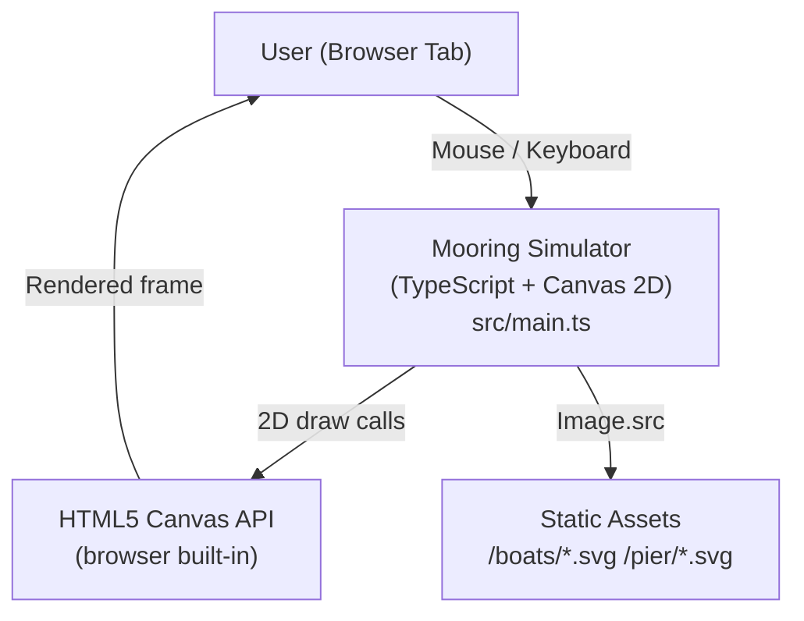
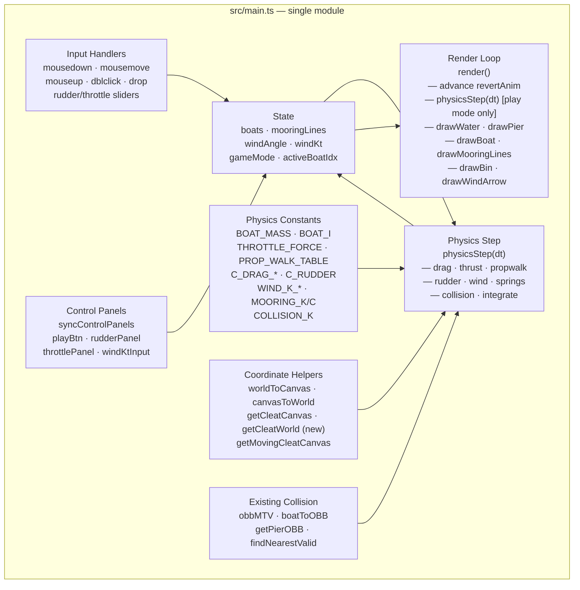
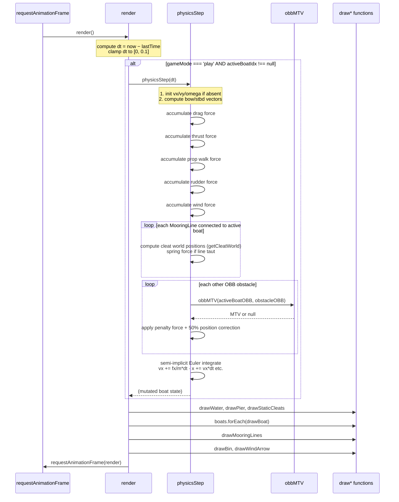

# Architecture — Physics Integration

*Every decision references facts in `docs/Research/`.*

---

## Decisions Made Here

| # | Decision | Rationale | Source |
|---|----------|-----------|--------|
| D1 | Single-file addition — no new modules | The entire app is `src/main.ts`; creating separate modules requires Vite config changes and build wiring; physics is self-contained enough to live inline | `docs/Research/code-map.md` §Extension Points |
| D2 | Variable `dt` from `requestAnimationFrame`, clamped to [0, 0.1 s] | rAF is the only loop; fixed-timestep accumulator adds complexity; at 60fps dt≈16 ms, at 30fps dt≈33 ms — both stable with linear drag and mooring spring constants chosen | `docs/Research/constraints.md` T1, T2 |
| D3 | Semi-implicit Euler integration | Stable for spring systems at game-scale dt; simpler than RK4; standard for real-time simulators | `docs/Research/constraints.md` §What Can Be Decided |
| D4 | Reuse OBB SAT (`obbMTV`) for collision response | Already correct, already tested; hull shape difference from true bezier polygon is minor at gameplay speeds; bezier polygon would add 200+ lines of sampling code | `docs/Research/constraints.md` T5; constraints.md §What Can Be Decided (hull collision fork) |
| D5 | Penalty spring collision (not impulse) | Fits the force accumulator pattern already designed; no constraint solver needed; `COLLISION_K` is large enough to prevent visible penetration at dt≤0.1 s | original architecture.md D3 |
| D6 | Active-boat-only physics | User requirement; inactive boats remain static (no wind drift) | `docs/Research/task-brief.md` §Facts Q2 answer |
| D7 | Linear drag model (F = C×v, not C×v²) | Simpler, numerically stable, easy to tune; quadratic drag is more realistic but makes spring stability harder to reason about | `docs/Research/constraints.md` §What Can Be Decided |
| D8 | Natural length = distance at attachment | Rope is taut at placement; no pre-tension; slack when boat drifts toward static end | domain-model.md §MooringLine |

---

## C4 Context Diagram



No network calls after page load. No server, no external APIs.

---

## C4 Container Diagram (within `src/main.ts`)



---

## Per-Frame Sequence Diagram



---

## Physics Force Diagram (per boat, per frame)

```
                          WIND
                           ↓ (apparent wind angle)
            ┌──────────────────────────────┐
   DRAG ←── │    ACTIVE BOAT               │ ──→ DRAG
            │    (fx, fy, torque)          │
            │    x, y, heading             │
            │    vx, vy, omega             │
            └────────────┬─────────────────┘
                         │
               ┌─────────┼──────────┐
               ↓         ↓          ↓
           THRUST   PROP WALK    RUDDER
          (stern)   (stern)      (stern)
                         │
               ┌─────────┴──────────┐
               ↓                    ↓
          MOORING LINES         COLLISION
       (at each cleat)        (pier / boats)
       spring+damper         penalty spring
```

All forces sum into `(fx, fy, torque)` before integration.
Application point of each force enters the torque calculation: `τ += rx × fy − ry × fx`.

---

## Render Loop `dt` Tracking

```typescript
let lastTime = 0;

function render(now: number): void {
  const dt = Math.min((now - lastTime) / 1000, 0.1);  // seconds, clamped
  lastTime = now;

  if (gameMode === 'play' && activeBoatIdx !== null) {
    physicsStep(dt);
  }

  // ... draw calls ...
  requestAnimationFrame(render);
}
```

`requestAnimationFrame` passes a `DOMHighResTimeStamp` in milliseconds. Converting to seconds
and clamping to 0.1 s prevents the spiral-of-death when the tab is backgrounded (constraint T2).

Source: `docs/Research/constraints.md` T1, T2.

---

## Play Mode Toggle Reset

When transitioning from `'setup'` → `'play'`, active boat velocity is **not** reset.
In setup mode, `vx/vy/omega` are absent (undefined) — `physicsStep` initialises to 0.
On re-entry to play after a previous session, we zero velocities explicitly:

```typescript
// In playBtn click handler, when entering play:
if (activeBoatIdx !== null) {
  boats[activeBoatIdx].vx = 0;
  boats[activeBoatIdx].vy = 0;
  boats[activeBoatIdx].omega = 0;
}
```

This prevents phantom velocities from a previous play session carrying over.

---

## Mooring Line Creation Change

One call site must change from:
```typescript
mooringLines.push({ from: pendingCleat, to: hitCleat });
```
to:
```typescript
mooringLines.push({
  from: pendingCleat,
  to: hitCleat,
  naturalLength: computeNaturalLength(pendingCleat, hitCleat),
});
```

`computeNaturalLength` calls `getCleatWorld` for both endpoints and returns their distance.

---

## Collision Handling in Physics vs. Drag Validation

The existing `obbMTV` / `findNearestValid` code is used during **drag-and-drop** to validate placement (setup mode only). Physics uses `obbMTV` for a different purpose — **force generation** in play mode. Both usages co-exist without interference because:

- Setup drag: collision → teleport boat to nearest valid position.
- Physics: collision → add penalty force (no teleport, soft wall).

The two paths are mutually exclusive (`gameMode` gates them).

---

## MVP Scope Boundary

| Feature | In scope | Deferred |
|---------|---------|---------|
| Monohull full physics (all 6 forces) | ✓ | — |
| Catamaran physics (twin engines + prop walk) | ✓ | — |
| Wind force on active boat | ✓ | — |
| Wind / drift on inactive boats | — | post-MVP |
| Mooring spring + damper | ✓ | — |
| Inextensible (rigid) mooring lines | — | post-MVP |
| Hull-accurate bezier polygon collision | — | post-MVP |
| Boat–boat collision physics | ✓ (OBB) | hull-accurate |
| Pier collision physics | ✓ (OBB pier) | — |
